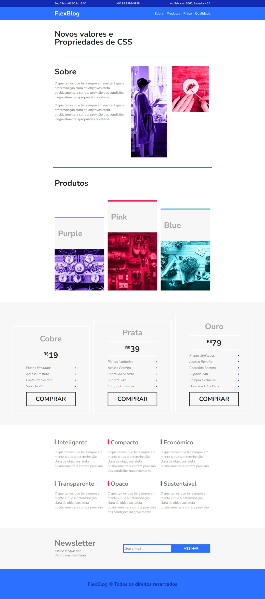

# 💻 FlexBlog - CSS Flexible Box Layout

## 📃 About The Project

- The development of the blog aimed to demonstrate the creation of a page with flexbox, enabling a fluid, flexible and fully responsive layout, avoiding the immense amount of lines of code in the media queries.

- O desenvolvimento do blog teve como objetivo demonstrar a criação de uma página com o flexbox, possibilitando um layout fluido, flex e totalmente responsivo, evitando a quantidade imensa de linhas de código nas medias queries.

## 🛠️ Tools/Ferramentas

- HTML5
- CSS3

